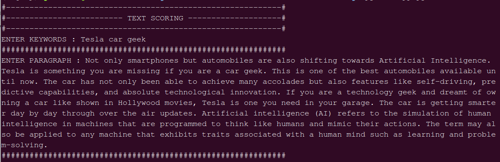
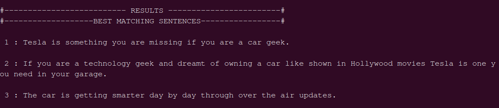

# AI ML - Text Keyword Match NLP

A Python based AI ML package for generating the best matching text from a paragraph for a given keyword/sentence.
A user can pass a keyword and a paragraph/text content throught the terminal and the paragraph undergoes cleaning process by eliminating special characters from the text,
then preprocessing technique is applied to each sentences by removing stopwords and tokenizing it. 

The sentence score is calculated by applying bleu_score. Here a cumulative bleu score is calculated for the sentences against the keyword input as reference.Then the best scored 3 sentences
are displayed as output.

## Table of contents

- [Getting started](#getting-started)
- [Features](#features)
- [Usage](#usage)
- [Want to Contribute?](#want-to-contribute)
- [Need Help / Support?](#need-help)
- [Collection of Other Components](#collection-of-components)
- [Changelog](#changelog)
- [Credits](#credits)
- [License](#license)
- [Keywords](#Keywords)

## Getting started

Prerequisites for running the code are:

Python = 3.5 

nltk = 3.4

or
```
pip install nltk
```

We have tested our program in above version, however you can use it in other versions as well.

## Features

- Performs text cleaning
- Uses nltk's sentence_bleu score for text scoring. 

## Usage

Inside the project's directory run:

```
python app.py
```
Enter keyword and a paragraph.
It will display sentences with most relavent text to the keyword entered.




Output:



## Want to Contribute?

- Created something awesome, made this code better, added some functionality, or whatever (this is the hardest part).
- [Fork it](http://help.github.com/forking/).
- Create new branch to contribute your changes.
- Commit all your changes to your branch.
- Submit a [pull request](http://help.github.com/pull-requests/).

-----

## Need Help? 

We also provide a free, basic support for all users who want to use this AI ML based NLP text scoring technique for their projects. In case you want to customize this text scoring technique for your development needs, then feel free to contact our [AI ML developers](https://www.weblineindia.com/ai-ml-dl-development.html).

-----

## Collection of Components

We have built many other components and free resources for software development in various programming languages. Kindly click here to view our [Free Resources for Software Development](https://www.weblineindia.com/software-development-resources.html).

------

## Changelog

Detailed changes for each release are documented in [CHANGELOG.md](./CHANGELOG.md).

## Credits

Refered NLTK bleu score for evaluating sentence match.  [NLTK](http://www.nltk.org/_modules/nltk/translate/bleu_score.html).

## License

[MIT](LICENSE)

[mit]: https://github.com/miguelmota/is-valid-domain/blob/e48e90f3ecd55431bbdba950eea013c2072d2fac/LICENSE

## Keywords

 nlp, nltk, sentence-bleu, text-scoring, keyword-match, similar-sentence, keyword-match-text, sent-tokenize, artificial-intelligence, machine-learning, ai-ml,tokenization, stopwords removal
